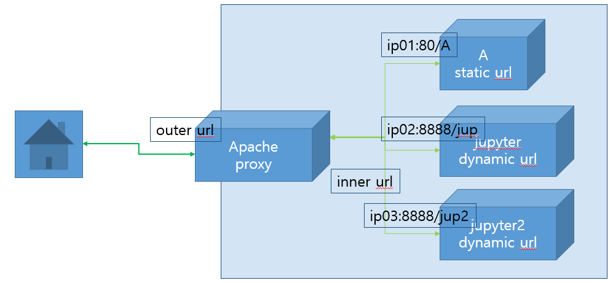
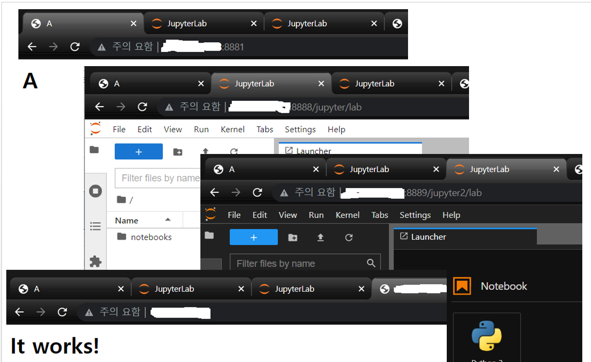
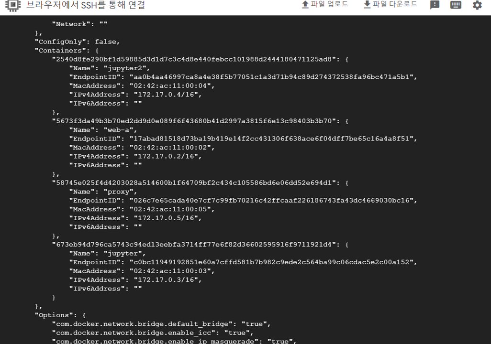

# step by step manual  
## 0. Overview  
System architecture  
   

## 1. web server A  
```bash
echo "<html><head><title> A </title><meta http-equiv='Content-Type' content='text/html; charset=utf-8' /></head><body><h1> A </h1></body></html>" > ~/index.html 
# nginx web server run with index.html  
sudo docker run -d --rm -v ~/index.html:/usr/share/nginx/html/index.html -p 8881:80 --name web-a nginx  
```

## 2. jupyter lab web server  
```bash
# sudo docker run -itd --rm --name jupyter -p 8888:8888 shwsun/jupyter-spark jupyter lab --allow-root --ip='*' --NotebookApp.allow_origin='*' --NotebookApp.notebook_dir='/tf' --workspace='/tf' --NotebookApp.token='' --NotebookApp.password='' --NotebookApp.base_url='/jupyter'
sudo docker run -itd --rm --name jupyter -p 8888:8888 shwsun/jupyter-spark jupyter lab --allow-root --ip='*' --NotebookApp.allow_origin='*' --NotebookApp.notebook_dir='/tf' --workspace='/tf' --NotebookApp.base_url='/jupyter'   
sudo docker run -it --rm --name jupyter -p 8888:8888 shwsun/jupyter-spark jupyter lab --allow-root --ip='*' --NotebookApp.allow_origin='*' --NotebookApp.notebook_dir='/tf' --workspace='/tf' --NotebookApp.base_url='/jupyter'  
# to get login token  
sudo docker exec -it jupyter /bin/bash -c "echo 'this is a.'>/tf/jupyter.txt"
sudo docker exec -it jupyter jupyter server list  
```
## 3. jupyter lab web server 2    
```bash
sudo docker run -itd --rm --name jupyter2 -p 8889:8888 shwsun/jupyter-spark jupyter lab --allow-root --ip='*' --NotebookApp.allow_origin='*' --NotebookApp.notebook_dir='/tf' --workspace='/tf' 
# to get login token  
sudo docker exec -it jupyter2 jupyter server list  
```
## 4. http proxy  
- run apache reverse proxy server  
```bash
# 3. apache docker run
sudo docker run -d --rm --name proxy -p 80:80 httpd
```

## 웹 사이트 확인  
1~4 까지를 실행하면, 아래와 같은 웹페이지를 확인할 수 있습니다.  
- <ip>:8881 
- <ip>:8888/jupyter  
- <ip>:8889/jupyter2  
- <ip>:80  
  

---  
## proxy setting  
<ip>:80 에서 서비스하고 있는 Apache2 proxy 서버를 제외하고 나머지 서버는 내부에서만 접근 가능하고, 
외부에서는 `<ip>/A`, `<ip>/jupyter`, `<ip>` 로 접근 가능하게 프락시를 설정합니다.  

- 먼저, 위에서 생성한 4개 컨테이너의 내부 ip를 확인합니다. 
```bash
# network 목록 확인  
# sudo docker network ls 
# 기본으로 bridge 에 할당된다.  
sudo docker inspect bridge  
```
- 컨테이너 각각에 부여된 ip는 아래와 같습니다. 
   


- `httpd-vhosts.conf` 파일 상단의 변수 선언부를 확인한 ip에 맞게 수정합니다.  
- 수정한 설정 파일을 apache 서버에 배포합니다.  
```bash
# 미리 준비해 둔 설정파일 proxy 서버 설정파일 경로에 복사  
sudo docker cp httpd.conf proxy:/usr/local/apache2/conf/httpd.conf
sudo docker cp httpd-vhosts.conf proxy:/usr/local/apache2/conf/extra/httpd-vhosts.conf  
# apache restart 
sudo docker exec -it proxy apachectl restart

```

- jupyter2를 /로 다시 실행합니다.  
```bash
sudo docker run -it --rm --name jupyter2 -p 8889:8888 shwsun/jupyter-spark jupyter lab --allow-root --ip='*' --NotebookApp.allow_origin='*' --NotebookApp.notebook_dir='/tf' --workspace='/tf'
```

